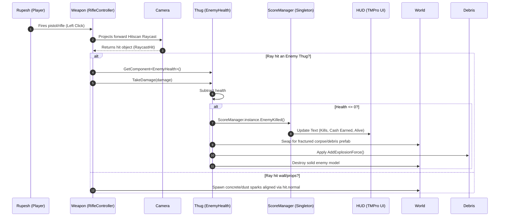

# 🎮 ZERO DRAG - Game Design Document (GDD)

> **"In this city, hesitation is friction. Friction is drag. We operate with Zero Drag."**
> *A Gritty Crime Thriller FPS about Rupesh's descent from an ordinary man into a ruthless, frictionless gangster, built on precise physics and clean architectural design.*

---

## 📖 1. Executive Summary

### 1.1 Core Concept
**Zero Drag** is a stylized, physics-driven, single-player First-Person Shooter (FPS) crime thriller set in a gritty, neon-drenched metropolis controlled by warring syndicates. The player controls **Rupesh**, a completely ordinary citizen who is pushed to the edge after witnessing a high-level mob execution. Hunted by corrupt police and cartel hitmen, Rupesh undergoes a dark psychological and physical evolution—transforming into a cold-blooded, high-agility gangster. 

The name **Zero Drag** represents Rupesh's ultimate state: a lethal operator who moves and shoots with zero hesitation, zero emotional delay, and absolute precision. The game loop blends fast-paced, responsive locomotion, hitscan gunplay, gang territory economy management, and highly satisfying destructible environment physics.

### 1.2 Product Identity & Tagline
* **Tagline:** *"Human reaction time is inefficient. Hesitation creates delay. Delay gets you killed. In this underworld, we removed the drag. Rupesh wasn't born a killer. He evolved."*
* **Genre:** Crime Thriller / High-Mobility Physics FPS
* **Platform:** Windows (PC)
* **Target Audience:** Fans of high-stakes action films (like John Wick), tactical urban shooters, and stylized physics gameplay.
* **Developer:** Sunny Rajput (Lead Architect & Programmer)
* **Engine:** Unity (URP - Universal Render Pipeline)

### 1.3 High-Level Design Pillars
1. **From Ordinary to Kingpin:** Experience Rupesh's psychological and tactical evolution. The player starts weak, salvages gangster weapons/gear, and builds a dominant criminal empire.
2. **Tactical Kinetic Precision:** High-speed urban parkour (jumping, sprinting, sliding) utilizing clean Newtonian kinematics for absolute control.
3. **Satisfying Cinematic Feedback:** Gritty, high-impact gunplay. On-kill physics swap solid enemies into physical fractured debris (shattering glass, wooden crates, and rival thugs), complete with muzzle flashes and directional spark/blood FX.
4. **Decoupled Architecture:** Clean, maintainable Unity scripts leveraging the Singleton and Single Responsibility patterns.

---

## 🎭 2. Narrative & World Design

```mermaid
graph TD
    A[Rupesh: Ordinary Citizen] --> B[Witnesses High-Level Mob Hit]
    B --> C[Hunted by Rival Gangs & Corrupt Cops]
    C --> D[Cornered in Abandoned Warehouse]
    D --> E[Choice: Die or Pick up the Gun]
    E --> F[Reactivation: "Zero Drag" Mental State Activated]
    F --> G[Gritty Evolution: Salvaging Turf, Cash & Guns]
    G --> H[Climbing the Ranks to Become the Ultimate Gangster]
```

### 2.1 The Setting
Set in a rain-slicked, modern metropolitan dystopia where the line between the police force and criminal syndicates has completely vanished. The city operates on pure efficiency and ruthless violence. Those who hesitate are eliminated.

### 2.2 Story Script (Opening Cutscene)

#### Scene 1 – Darkness
* **Visual:** Black screen. Loud rain pouring. Heavy mechanical thunder rolls. Faint light flickers on in a damp, rust-covered industrial warehouse. Rupesh lies bruised and bleeding on the concrete floor, surrounded by broken crates.
* **Detail:** A dropped wallet on the floor shows an ID: `"Rupesh - Ordinary Citizen."`

#### Scene 2 – The Underworld
* **Visual:** Flashing neon signs, fast cuts of black sedans speeding through wet streets, backroom cash exchanges, and silhouetted gangsters.
* **Voiceover (Mob Boss):** *"Human reaction time is inefficient. Hesitation creates delay. Delay creates failure. In our syndicate, we removed the drag."*

#### Scene 3 – The Hit
* **Visual:** Rupesh hiding behind a stack of wooden crates, eyes wide with terror, witnessing a ruthless execution of a gang boss. The rival gangsters turn their weapons toward his hiding spot.
* **HUD Overlay:** 
  * `Heart Rate: 160 BPM`
  * `Adrenaline: Critical`

#### Scene 4 – The Chase
* **Visual:** Rupesh running frantically through dark, rain-soaked alleys. Gunshots spark off metal pipes behind him. He slips into the abandoned warehouse, barricading the door.
* **Voiceover:** *"He saw too much. Eliminate the drag."*

#### Scene 5 – The Awakening
* **Visual:** Trap door closes. Rupesh leans against the wall, breathing heavily. He spots an old, heavy revolver lying in a toolbox. He reaches out.
* **HUD Flickers & Calibrates:** 
  * `Subject: Rupesh`
  * `Status: Target Marked`
  * `Combat Efficiency: 12% (Unarmed)`
  * `Survival Probability: Obsolete`
* **Rupesh (Whispering):** *"If they want a monster... I'll give them one."*

#### Scene 6 – The Threat Arrives
* **Visual:** The heavy metal warehouse door begins to spark as a blowtorch cuts through the hinges. Outside, rival hitmen prepare their automatic rifles.
* **Voiceover:** *"They calculate every angle. They control the streets. They predict everything... But you are not in their book. They don't know what a desperate man will do."*

#### Scene 7 – The Evolution
* **HUD displays:** `Mobility Amplified` | `Trigger Response: Frictionless` | `Upgrade Slots Unlocked`
* **Rupesh:** *"I'm going to take everything they own. Gun by gun. Dollar by dollar."*

#### Scene 8 – Incoming Danger
* **Visual:** The warehouse door crashes down. Shadows of armed hitmen flood the entryway. 
* **Warning HUD:** `Hostile Gangsters Detected.`
* **Inner Voice:** *"No fear. No hesitation. Zero drag."*

#### Scene 9 – Cold Focus
* **Visual:** Rupesh grips the weapon. His hands stop shaking. His eyes narrow. The ambient sounds of rain and wind completely fade out, replaced by a loud, slow heartbeat.
* **System message:**  
  * `Neural Drag – 0%`
  * `Focus Mode – Active`

#### Scene 10 – Transition to Gameplay
* **Visual:** Rupesh steps out from behind the crates. Sunlight cuts through the broken warehouse roof, reflecting off his gun barrel.
* **Title:** **ZERO DRAG**
* **Subtitle:** *"Hesitation Is Death. Evolve."*
* **Visual:** Camera smoothly transitions to the classic first-person perspective.
* **Objective:** `Eliminate the Hit Squad.`
* **Control:** Player gains full tactical control.

---

## 🕹️ 3. Core Gameplay & Mechanics

Zero Drag is characterized by momentum-driven urban combat where the player moves with deadly, frictionless speed.

### 3.1 Gritty Physics-Based Locomotion
To simulate an elite, highly-trained gangster, the player movement uses a manual `CharacterController` instead of standard rigidbodies to maintain sharp, instant WASD responsiveness.

#### Movement Kinematics
Frictionless movement calculations run independently of frame rate. Rupesh accelerates, sprints, and stops instantly:
```csharp
float x = Input.GetAxis("Horizontal");
float z = Input.GetAxis("Vertical");
Vector3 move = transform.right * x + transform.forward * z;
controller.Move(move * speed * Time.deltaTime);
```

### 3.2 Dynamic Camera & The "Exorcist" Clamp
To simulate tight combat aiming, mouse looking is split:
* **Horizontal Look (Yaw):** Rotates Rupesh's body structure to direct physical movement.
* **Vertical Look (Pitch):** Clamps camera rotation to exactly $+90^{\circ}$ (straight up) and $-90^{\circ}$ (straight down) to prevent unnatural camera flips during vertical gun battles.
```csharp
xRotation -= mouseY;
xRotation = Mathf.Clamp(xRotation, -90f, 90f);
playerCamera.localRotation = Quaternion.Euler(xRotation, 0f, 0f);
```

### 3.3 Momentum Gravity & Down-Force Reset
Gravity is calculated manually to manage high-velocity drops. To prevent gravity from compounding infinitely while Rupesh stands on a floor, a gravity reset simulates realistic downward friction:
```csharp
if (isGrounded && velocity.y < 0)
{
    velocity.y = -2f; // Firmly clamps Rupesh to walking surfaces
}
```

### 3.4 Parkour Ground Detection
Using a custom sphere cast at Rupesh's feet to allow fluid jumps and slides off railings, sidewalks, and crates.
* **Offset Trans:** Evaluated at the `GroundCheck` empty GameObject positioned at $Y = -1.0$.
* **Detection Radius:** $0.4\text{ units}$.
* **Layer Filtering:** Restricts detection to the `"Ground"` layer (ignoring props, triggers, and enemies).
```csharp
isGrounded = Physics.CheckSphere(groundCheck.position, groundDistance, groundMask);
```

### 3.5 Kinematic Tactical Jumps
Jumping height is calculated using Newtonian kinematics rather than arbitrary force numbers. Rupesh leaps precisely over gaps and onto crates:

$$v^2 = u^2 + 2as \implies u = \sqrt{h \times -2 \times g}$$

```csharp
if (Input.GetButtonDown("Jump") && isGrounded)
{
    velocity.y = Mathf.Sqrt(jumpHeight * -2f * gravity);
}
```

### 3.6 Hitscan Urban Shootouts
* **Action:** Direct hitscan Raycasting from the center of the camera forward, representing immediate bullet paths.
* **Target Interface:** Grabs `EnemyHealth` to trigger gangster damage.
* **Visual Polish:** Concrete and metal spark particles align perpendicular to wall/floor surfaces using `hit.normal`.
```csharp
GameObject sparks = Instantiate(hitEffect, hit.point, Quaternion.LookRotation(hit.normal));
Destroy(sparks, 0.5f); // Prevent garbage collection memory leaks
```

### 3.7 Cinematic Fracture Destruction
Rival gangsters and environment cover (crates, windows) shatter violently upon lethal hits using the **Fake Switch** technique:
1. Solid meshes are instantly swapped on death for pre-fractured models (consisting of $8\text{--}15$ separate physical pieces).
2. A radial explosion force blows the pieces apart, simulating dramatic cinematic impact:
```csharp
Rigidbody[] rbs = brokenInstance.GetComponentsInChildren<Rigidbody>();
foreach (Rigidbody rb in rbs)
{
    rb.AddExplosionForce(500f, transform.position, 5f);
}
```

---

## 🛠️ 4. Technical Architecture & Data Flow

Decoupled scripts communicate globally to process stats, audio, and physics.



### 4.1 Script Structure
```
Assets/Scripts/
├── Player/
│   ├── PlayerMovement.cs        # Rupesh movement, looking, gravity, and jumping
│   ├── PlayerHealth.cs          # Health management and bullet damage inputs
│   ├── Playerstats.cs           # Tracks Rupesh's Level, XP, and criminal Cash balance
│   ├── SimplePlayerController.cs# Simplified exploration scripts
│   └── ThirdPersonCamera.cs     # Camera tracking
├── Weapon/
│   ├── RifleController.cs       # Hitscan shoot, ammo reload, and PlayOneShot audio
│   └── WeaponPickUp.cs          # Picking up gangster weaponry (Pistols, Rifles)
├── Npc/
│   ├── EnemyController.cs       # Rival thug AI (patrol, chase, shoot Rupesh)
│   ├── NPCController.cs         # Ambient urban civilians
│   └── NPCSpawner.cs            # Spawns rival hitmen in active turfs
├── Mission/
│   ├── MissionManager.cs        # Centralized mission structure and territory tracking
│   ├── Mission1/                # Heist/Warehouse markers
│   └── Mission2/                # Street ambush markers
├── UI/
│   ├── ButtonHoverEffect.cs     # Gritty neon UI styling
│   ├── DialogueManager.cs       # Text subtitles for gangster interactions
│   └── missiondistance.cs       # Waypoint tracking
└── Manager/
    ├── ScoreManager.cs          # Central Singleton tracking bounties, cash, and kills
    ├── MainMenu.cs              # Core menu system (Sensitivity, Resolution, Quit)
    ├── PauseMenu.cs             # Pauses timescales and releases cursor
    └── GameOverManager.cs       # Respawn control
```

---

## 📅 5. 30-Day Development Roadmap

### 5.1 Phase 1: Gunplay & Feel (Days 1 - 7)
* **Day 1 (Feb 20):** **Pistol & Rifle Core:** Develop main hitscan weapons and damage scripts.
* **Day 2 (Feb 21):** **Magazine Management:** Ammo constraints, reloading timing, and UI counters.
* **Day 3 (Feb 22):** **Iron Sights (ADS):** Tight camera zoom and weapon sway damping.
* **Day 4 (Feb 23):** **Recoil & Camera Kick:** Physical recoil recovery spring and camera camera shake.
* **Day 5 (Feb 24):** **Bullet Decals & Sparks:** Spawning blood/concrete impact particles based on surface angles.
* **Day 6 (Feb 25):** **Audio Mix:** Weapon shots, metal shell drops, and physical impact audio.
* **Day 7 (Feb 26):** **Action Polish:** Fluid sprint-to-fire transitions and tactical holster states.

### 5.2 Phase 2: Territory & Economy (Days 8 - 14)
* **Day 8 (Feb 27):** **Mission Manager:** Set up gang heist objectives and escape routes.
* **Day 9 (Feb 28):** **Bounty System:** Code XP and Cash updates linked to rival kills and completed heists.
* **Day 10 (Mar 01):** **Saving Turf Data:** JSON save/load scripts for Rupesh's cash balance and weapon unlocks.
* **Day 11 (Mar 02):** **Neon HUD Design:** Style clean UI text tracking Cash, Ammo, and HP.
* **Day 12 (Mar 03):** **Street Triggers:** Add interaction triggers for dark alleyway contacts and heist points.
* **Day 13 (Mar 04):** **Bounty Summary UI:** Show heist grades, laundered cash payouts, and XP gains.
* **Day 14 (Mar 05):** **Progression Locks:** Unlock Mission 2 (City Streets) only after securing Mission 1 (Warehouse).

### 5.3 Phase 3: Rival Gangs & Urban AI (Days 15 - 21)
* **Day 15 (Mar 06):** **Map Design:** Build gritty urban back-alleys, neon streets, and rain-slicked warehouses.
* **Day 16 (Mar 07):** **NavMesh Navigation:** Bake city street layouts for smart tactical flanking.
* **Day 17 (Mar 08):** **Thug Types:** Melee-driven gang chasers and rifle-wielding syndicate enforcers.
* **Day 18 (Mar 09):** **Ambush Spawner:** Trigger waves of hitmen when Rupesh enters contested turf.
* **Day 19 (Mar 10):** **Ambient Civilians:** City pedestrians that panic and run during gunfights.
* **Day 20 (Mar 11):** **Waypoint Guide:** Holographic 3D arrows tracking objective distances.
* **Day 21 (Mar 12):** **Atmospheric Lighting:** Dark shadows, neon light reflections, bloom, and heavy rain fog.

### 5.4 Phase 4: Polish & Build (Days 22 - 28)
* **Day 22 (Mar 13):** **Main Menu:** Dark, atmospheric title scene featuring options and quit buttons.
* **Day 23 (Mar 14):** **Settings UI:** Wire mouse sensitivity sliders and master volume levels.
* **Day 24 (Mar 15):** **Death & Retribution:** Respawn checks at safehouses and bounty deductions.
* **Day 25 (Mar 16):** **Underworld Kill Feed:** Visual banners showing enforcers eliminated.
* **Day 26 (Mar 17):** **Industrial Ambience:** Synth-wave heavy soundtracks, sirens, and rain loops.
* **Day 27 (Mar 18):** **Vignette & Chromatic Aberration:** Post-processing screen edge effects on low health.
* **Day 28 (Mar 19):** **Victory State:** Code the final confrontation with the syndicate leader and credits roll.

### 5.5 Phase 5: Build Output (Days 29 - 30)
* **Day 29 (Mar 20):** **The Bug Bash:** Fix collider issues, overlapping sound loops, and UI formatting.
* **Day 30 (Mar 21):** **Standalone EXE Compiler:** Standard high-performance Windows build package.

---

## 🚫 6. Scope Limitations (Frozen Scope)

* **No Multiplayer:** Strictly single-player narrative focusing on Rupesh's climb to power.
* **No Vehicle Driving:** Action is strictly infantry-based parkour and shooting.
* **No Complex Inventories:** Keeps quick weapon hotkey selections only.
* **No Voice Acting:** Story scripts read via stylized holographic text subtitles.

---

## 📦 7. Assets Guide

* **Models:** Quaternius Ultimate Sci-Fi & Character packs (Rival thugs, props, rusty warehouse containers).
* **Weapons:** Kenney Blaster Kit (Futuristic heavy pistol and tactical carbine models).
* **VFX:** Cartoon FX Free (Concrete hits, blood splatters, muzzle flash, and grenade pops).
* **Textures:** Polyhaven (Concrete walls, wet asphalt, rusted metal for safehouses).
- **Audio:** Freesound.org (Rain-ambience, heavy gunshots, metallic reloads, syndicate boss voice lines).

---

> [!IMPORTANT]
> This Game Design Document serves as the official design blueprint for *Zero Drag*. Maintain data integrity around the character of Rupesh and credit Sunny Rajput as the sole creator in all project menus and credits files.
