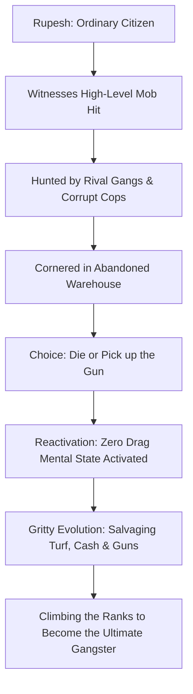
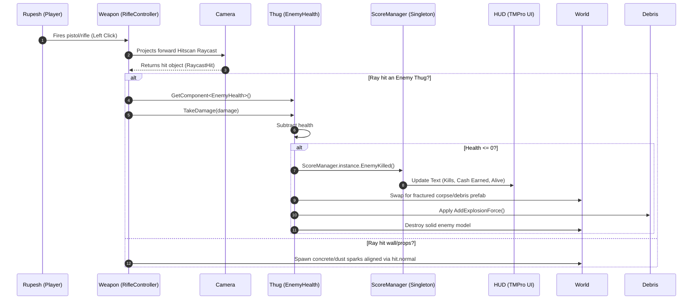

# 🎮 ZERO DRAG - Game Design Document (GDD)

> **"In this city, hesitation is friction. Friction is drag. We operate with Zero Drag."**
> *A Gritty Crime Thriller FPS about Rupesh's descent from an ordinary man into a ruthless, frictionless gangster, built on precise physics and clean architectural design.*

---

## 📖 1. Executive Summary

### 1.1 Core Concept
**Zero Drag** is a stylized, physics-driven, single-player First-Person Shooter (FPS) crime thriller set in a gritty, neon-drenched metropolis controlled by warring syndicates. The player controls **Rupesh**, a completely ordinary citizen who is pushed to the edge after witnessing a high-level mob execution. Hunted by corrupt police and cartel hitmen, Rupesh undergoes a dark psychological and physical evolution—transforming into a cold-blooded, high-agility gangster. 

The name **Zero Drag** represents Rupesh's ultimate state: a lethal operator who moves and shoots with zero hesitation, zero emotional delay, and absolute precision. The game loop blends fast-paced, responsive locomotion, hitscan gunplay, gang territory economy management, and highly satisfying destructible environment physics.

### 1.2 Product Identity & Tagline
* **Tagline:** *"Human reaction time is inefficient. Hesitation creates delay. Delay gets you killed. In this underworld, we removed the drag. Rupesh wasn't born a killer. He evolved."*
* **Genre:** Crime Thriller / High-Mobility Physics FPS
* **Platform:** Windows (PC)
* **Target Audience:** Fans of high-stakes action films (like John Wick), tactical urban shooters, and stylized physics gameplay.
* **Developer:** Sunny Rajput (Lead Architect & Programmer)
* **Engine:** Unity (URP - Universal Render Pipeline)

### 1.3 High-Level Design Pillars
1. **From Ordinary to Kingpin:** Experience Rupesh's psychological and tactical evolution. The player starts weak, salvages gangster weapons/gear, and builds a dominant criminal empire.
2. **Tactical Kinetic Precision:** High-speed urban parkour (jumping, sprinting, sliding) utilizing clean Newtonian kinematics for absolute control.
3. **Satisfying Cinematic Feedback:** Gritty, high-impact gunplay. On-kill physics swap solid enemies into physical fractured debris (shattering glass, wooden crates, and rival thugs), complete with muzzle flashes and directional spark/blood FX.
4. **Decoupled Architecture:** Clean, maintainable Unity scripts leveraging the Singleton and Single Responsibility patterns.

---

## 🎭 2. Narrative & World Design



### 2.1 The Setting
Set in a rain-slicked, modern metropolitan dystopia where the line between the police force and criminal syndicates has completely vanished. The city operates on pure efficiency and ruthless violence. Those who hesitate are eliminated.

### 2.2 Story Script (Opening Cutscene)

#### Scene 1 – Darkness
* **Visual:** Black screen. Loud rain pouring. Heavy mechanical thunder rolls. Faint light flickers on in a damp, rust-covered industrial warehouse. Rupesh lies bruised and bleeding on the concrete floor, surrounded by broken crates.
* **Detail:** A dropped wallet on the floor shows an ID: `"Rupesh - Ordinary Citizen."`

#### Scene 2 – The Underworld
* **Visual:** Flashing neon signs, fast cuts of black sedans speeding through wet streets, backroom cash exchanges, and silhouetted gangsters.
* **Voiceover (Mob Boss):** *"Human reaction time is inefficient. Hesitation creates delay. Delay creates failure. In our syndicate, we removed the drag."*

#### Scene 3 – The Hit
* **Visual:** Rupesh hiding behind a stack of wooden crates, eyes wide with terror, witnessing a ruthless execution of a gang boss. The rival gangsters turn their weapons toward his hiding spot.
* **HUD Overlay:** 
  * `Heart Rate: 160 BPM`
  * `Adrenaline: Critical`

#### Scene 4 – The Chase
* **Visual:** Rupesh running frantically through dark, rain-soaked alleys. Gunshots spark off metal pipes behind him. He slips into the abandoned warehouse, barricading the door.
* **Voiceover:** *"He saw too much. Eliminate the drag."*

#### Scene 5 – The Awakening
* **Visual:** Trap door closes. Rupesh leans against the wall, breathing heavily. He spots an old, heavy revolver lying in a toolbox. He reaches out.
* **HUD Flickers & Calibrates:** 
  * `Subject: Rupesh`
  * `Status: Target Marked`
  * `Combat Efficiency: 12% (Unarmed)`
  * `Survival Probability: Obsolete`
* **Rupesh (Whispering):** *"If they want a monster... I'll give them one."*

#### Scene 6 – The Threat Arrives
* **Visual:** The heavy metal warehouse door begins to spark as a blowtorch cuts through the hinges. Outside, rival hitmen prepare their automatic rifles.
* **Voiceover:** *"They calculate every angle. They control the streets. They predict everything... But you are not in their book. They don't know what a desperate man will do."*

#### Scene 7 – The Evolution
* **HUD displays:** `Mobility Amplified` | `Trigger Response: Frictionless` | `Upgrade Slots Unlocked`
* **Rupesh:** *"I'm going to take everything they own. Gun by gun. Dollar by dollar."*

#### Scene 8 – Incoming Danger
* **Visual:** The warehouse door crashes down. Shadows of armed hitmen flood the entryway. 
* **Warning HUD:** `Hostile Gangsters Detected.`
* **Inner Voice:** *"No fear. No hesitation. Zero drag."*

#### Scene 9 – Cold Focus
* **Visual:** Rupesh grips the weapon. His hands stop shaking. His eyes narrow. The ambient sounds of rain and wind completely fade out, replaced by a loud, slow heartbeat.
* **System message:**  
  * `Neural Drag – 0%`
  * `Focus Mode – Active`

#### Scene 10 – Transition to Gameplay
* **Visual:** Rupesh steps out from behind the crates. Sunlight cuts through the broken warehouse roof, reflecting off his gun barrel.
* **Title:** **ZERO DRAG**
* **Subtitle:** *"Hesitation Is Death. Evolve."*
* **Visual:** Camera smoothly transitions to the classic first-person perspective.
* **Objective:** `Eliminate the Hit Squad.`
* **Control:** Player gains full tactical control.

---

## 🕹️ 3. Core Gameplay & Mechanics

Zero Drag is characterized by momentum-driven urban combat where the player moves with deadly, frictionless speed.

### 3.1 Gritty Physics-Based Locomotion
To simulate an elite, highly-trained gangster, player movement is run entirely on a manual Unity `CharacterController` instead of standard heavy Rigidbodies. This enables instantaneous acceleration, zero sliding latency, and extremely sharp WASD keyboard responses. Frictionless calculations run independently of frame rate, allowing the player to sprint and stop instantly.

### 3.2 Dynamic Camera & The "Exorcist" Clamp
Aiming controls utilize split vertical and horizontal mouse-looking variables. The horizontal look (yaw) rotates the player's physical root body structure to guide movement directions, while the vertical look (pitch) is clamped strictly between exactly $+90^{\circ}$ (straight up) and $-90^{\circ}$ (straight down) to prevent unnatural camera flips during intense gunfights.

### 3.3 Momentum Gravity & Down-Force Reset
To manage high-speed vertical drops, gravity is simulated manually. A downward force reset activates when the player is grounded, firmly clamping the player down to walking platforms and preventing vertical velocity accumulation while standing.

### 3.4 Parkour Ground Detection
A custom sphere-cast ground test is executed continuously at the player's feet. Positioned at an offset of $Y = -1.0$ with a detection radius of $0.4\text{ units}$ and locked to the `"Ground"` layer (ignoring props and enemies), it ensures absolute fluid jumps and sliding movements off staircases, sidewalks, and street curbs.

### 3.5 Kinematic Tactical Jumps
Jumping heights are calculated on clean kinematic equations rather than arbitrary physics constants. The initial vertical leap velocity is computed dynamically using Newtonian kinematics: 

$$v^2 = u^2 + 2as \implies u = \sqrt{h \times -2 \times g}$$

This ensures that Rupesh leaps precisely over alleyway gaps and onto industrial crates at mathematically exact heights.

### 3.6 Hitscan Urban Shootouts
Firearms project immediate hitscan rays straight forward from the camera's viewport center. If a ray intersects a rival enforcer, it interfaces directly with damage handlers. Environmental impacts project muzzle sparks and concrete dust oriented dynamically perpendicular to wall normal vectors (`hit.normal`).

### 3.7 Cinematic Fracture Destruction
Enemies and cover debris shatter upon fatal bullet impacts using the **Fake Switch** deconstruction technique. The solid model is instantly disabled, instantiating a pre-fractured mesh version of the thug or crate. A radial explosion force is immediately broadcasted at the impact locus, blowing the physical debris fragments dynamically across the scene.

---

## 🛠️ 4. Technical Architecture & Data Flow

Decoupled scripts communicate globally to process stats, audio, and physics.



### 4.1 Script Structure
```
Assets/Scripts/
├── Player/
│   ├── PlayerMovement.cs        # Rupesh movement, looking, gravity, and jumping
│   ├── PlayerHealth.cs          # Health management and bullet damage inputs
│   ├── Playerstats.cs           # Tracks Rupesh's Level, XP, and criminal Cash balance
│   ├── SimplePlayerController.cs# Simplified exploration scripts
│   └── ThirdPersonCamera.cs     # Camera tracking
├── Weapon/
│   ├── RifleController.cs       # Hitscan shoot, ammo reload, and PlayOneShot audio
│   └── WeaponPickUp.cs          # Picking up gangster weaponry (Pistols, Rifles)
├── Npc/
│   ├── EnemyController.cs       # Rival thug AI (patrol, chase, shoot Rupesh)
│   ├── NPCController.cs         # Ambient urban civilians
│   └── NPCSpawner.cs            # Spawns rival hitmen in active turfs
├── Mission/
│   ├── MissionManager.cs        # Centralized mission structure and territory tracking
│   ├── Mission1/                # Heist/Warehouse markers
│   └── Mission2/                # Street ambush markers
├── UI/
│   ├── ButtonHoverEffect.cs     # Gritty neon UI styling
│   ├── DialogueManager.cs       # Text subtitles for gangster interactions
│   └── missiondistance.cs       # Waypoint tracking
└── Manager/
    ├── ScoreManager.cs          # Central Singleton tracking bounties, cash, and kills
    ├── MainMenu.cs              # Core menu system (Sensitivity, Resolution, Quit)
    ├── PauseMenu.cs             # Pauses timescales and releases cursor
    └── GameOverManager.cs       # Respawn control
```

---

## 🚫 5. Scope Limitations (Frozen Scope)

* **No Multiplayer:** Strictly single-player narrative focusing on Rupesh's climb to power.
* **No Vehicle Driving:** Action is strictly infantry-based parkour and shooting.
* **No Complex Inventories:** Keeps quick weapon hotkey selections only.
* **No Voice Acting:** Story scripts read via stylized holographic text subtitles.

---

## 📦 6. Assets Guide

* **Models:** Quaternius Ultimate Sci-Fi & Character packs (Rival thugs, props, rusty warehouse containers).
* **Weapons:** Kenney Blaster Kit (Futuristic heavy pistol and tactical carbine models).
* **VFX:** Cartoon FX Free (Concrete hits, blood splatters, muzzle flash, and grenade pops).
* **Textures:** Polyhaven (Concrete walls, wet asphalt, rusted metal for safehouses).
- **Audio:** Freesound.org (Rain-ambience, heavy gunshots, metallic reloads, syndicate boss voice lines).

---

> [!IMPORTANT]
> This Game Design Document serves as the official design blueprint for *Zero Drag*. Maintain data integrity around the character of Rupesh and credit Sunny Rajput as the sole creator in all project menus and credits files.
